=============
Action Blocks 
=============

social:
https://bsky.app/profile/otrealms.bsky.social

email for bug reports and enquiries: 
contact@pablotochez.com

:Version: 2.0.0 Beta

Action Blocks is a Blender add-on for constructing complex animations using real keyframes and Actions within a custom node-graph interface. 

Install using .zip file in Preferences->Extensions->Install from Disk. There is no need to extract the .zip file.

.. contents::

Recommended Practices and tips
------------------------------

* **Start animations on frame 1** Starting an animation at frame zero can create duration calculation issues for node display and generation of pose markers.

* **Optimize animations** Actions Nodes can become slow if Actions contain keyframes on every frame, for every channel. This be the case when the animation is baked or derived from performance capture. Use the decimator in the Animation Curves window to reduce unnecessary frames. 

* **Make a dedicated Root Bone or object** Required to use Root Motion. Some armatures use the hip bone for locomotion. Use the **Transfer Keyframes** Action Operator to copy selective channels to the new root. The new root channel group must first be initialised on the action by keying the desired channels. Often only the forward axis and vertical axis of rotation needs to be transferred. 

* **Make sure Root rotations are Euler** When using Root Motion. Use the **Convert Root** To Euler operator if rotations are quaternion. This will create new rotation channels and mute the old ones. Remember to also set the correct rotation mode on the Actor's root transform settings.

* **Include Scale Keyframes.** If there are no scale frames it can result in 0,0,0 scale values and actors that appear to shrink or grow. If this happens Alt-S will reset the the scale values to 1,1,1, Then ensure actions contain scale frames. Keep in mind that trimming such as using Action Range may exclude these frames.

* **Pose Markers** are cleared and generated in the Action Editor/Dope Sheet for the output Action.
  
Working With Slots
-------------------

*Action Blocks Node-graph Right Panel->Node*

When loading an action, available slots are detected. Once a chain is connected to an Action Out node, they will pass down the chain and be added to the output target action. Every time the target action is rebuilt,
these slots are updated and removed and are removed if they are no longer found in the chain.

Slots can be bypassed by unchecking them individually on each Action Node (Right panel->Node->Advanced).

When clicking Edit Action on and action or an Out node, or when selecting and Actor, the object will be matched with their last associated slot identifier. Therefore, it's not recommended to alternate between slots for a single object.
If there are multiple objects in a Actor collection, slots are assigned with their corresponding slots. This includes Shape Key slots for mesh objects.

Actors
------

*Action Blocks Node-graph Right Panel->Actors*

.. image:: Actors.JPG


Actors provide a convenient way to select objects and edit action on the correct object. An actor can be any collection containing objects with animation data and an assigned action.
If the assigned action is of the object or armature animation type, a root fcurve group can be set. When there are multiple actors, each Action Blocks node group will remember the last active actor.
Actors are used to pre-fill operators such as Edit, Convert Root to Euler, Mixamo conversion and Transfer Keyframes.

**Edit With Root Offsets** , When enabled with Root Motion, when clicking Edit Action, the Actor will be oriented at the beginning of the block's last calculated root motion coordinates.

**Pose Bones** , Pose bones are important bones for a gait cycle for functions including Pose Matching and Slide Removal. For FK rigs, upper thighs for slide removal, and additionally arm rotations are recommend for Pose Match. IK limbs are best associated with control bone locations.


Root Motion
===========

*Actors*

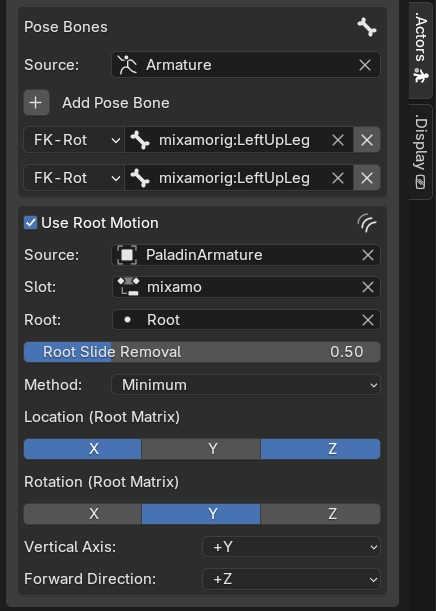

Root motion is the accumulated position and rotation of an actor's root position for calculating traversal motion such as walking and running.

* **Use Root Motion** , Applies the root motion process to all actions containing the assigned root fcurve groups. Nodes can be ignored using their 'Skip Root Motion' parameter.

* **Source** , The source object within the actor collection containing the root.

* **Slot** , The Action Slot containing root keyframes. **NOTE:** The actor objects should have an action assigned with some arbitrary keyframes during setup, in order to find the available slots and fcurve groups.

* **Root**, The Root fcurve group used for motion. Requires location and Euler rotation channels.
  
* **Slide Removal**, Works during blend transitions to reduce sliding. Uses Pose Bones to constrain Root motion movement to the activity of Pose Bones such as thighs(Fk) or feet controllers(IK).

* **Method**, Pose Bone animation affects root translation using the method; MIN-The lowest value is used, MAX-Highest value is used to constrain, SUM-The total of values are used to constrain Root translation.

* **Location/Rotation**, The axis which will be used for root motion. For objects, typically X,Y should be enabled for location and optionally Z for vertical climbs. Rotation is typically set to only the Z axis. For Bones. X and Z  with optionally Y. Rotation is usually on the Y axis. 
  **Note:** These options should match the root's final local coordinate even if the parent or armature is rotated 90 degrees.

* **Vertical Axis**, objects will typically use +Z up in world space with the exception of cameras which have +Y up. In pose pace bones are also +Y up. Bones transforms are relative to parents and therefore have their own rotation matrices and can differ depending on rigging convention and source of armature. For example a root bone sourced from another software may be forward facing rather than vertical when imported. Used for root motion offsets.

* **Forward Direction** , The typical facing direction for the actor. Used for root motion offsets.

Create Root Bone
~~~~~~~~~~~~~~~~~

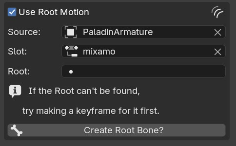

If the root source is an armature and the root group is not available, its assumed that there might not be a root bone. Using this operator will place a root bone at the origin. If a child bone is assigned in the popup dialog, the root becomes the parent. The required child bone is often the first spine bone or hips.

Nodes
-----
*Action Blocks Node-graph->Header Add or SHIFT + A->Action Nodes*

Frozen nodes
============

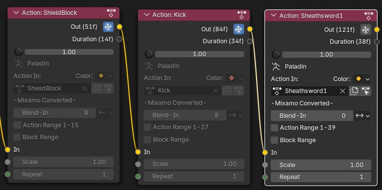

Freezing a node and all previous nodes, saving their frame range from being calculated and overwritten.
Un-freezing a node at the beginning of a chain will recursively unfreeze all nodes along the chain. Slight performance improvement.

Action Out Node
===============

.. image:: ActionOutNode.JPG

* **Target Action** , The Action to write keyframes onto.

* **Edit Action**, assigns the action to the active object but only if the active object is suitable for the action or uses a matching slot. Other the first best suitable object will be selected from the Actor collection.

* **Build Action** , manually rebuild animation output, required if  not using Auto-Refresh and when only updating source Actions without adjusting node parameters/

* **Auto-Refresh** , Update the Target Action when adjusting parameters or socket links.

* **Quality**

* * **Full** , No reduction in data.

* * **Draft** , Speed up build time by only using frame times and values, excludes handles.

* **Frame Step** , Reduce frames by keeping only every 'nth' frame for faster build time, especially when using baked or motion capture data. Does not affect root group.

* **Hold Frames** , Hold frames will be added at the end of each action or repeat such as when using Action Range. Not compatible with Root Motion.

Action Node
============

.. image:: ActionNode.JPG

* **Action In** , An input Action to contribute to the constructed output.

* **New Action** , If there is no action assigned it makes a new action and assigns it to the node. Otherwise, it makes a full copy of the active action and assigns it. Consider using this before using any operations on the action.

* **Edit Action**, assigns the action to the active object but only if the active object is suitable for the action or uses a matching slot. Other the first best suitable object will be selected from the Actor collection.

* **Frame Colour** , Set the dopesheet frame colour for this action's portion of the output.

* **Blend In** , Then number of frames to blend between current Action and previous frames.

* **Blend Direction** ,
    * Forwards - Blends with frames from the start of this block
    * Back - Blends with frames on the previous block
    * Both - Blends forward and back in the same number of frames. i.e if blend in=10, it will blend 10 frames back and 10 forward.
  
* **Action Range** , The Action's frame range, this uses built-in Action settings and is not controlled per-node.

* **Block Range** , The node's output frame range. Relative to block's first frame.

* **Scale** , Temporal scale the the action.

* **Repeat** , Repeat the entire action.


Advanced Options
~~~~~~~~~~~~~~~~~
*Action Blocks node-graph Right Panel->Node*

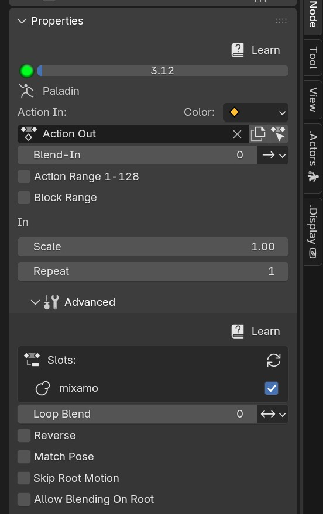

* **Slots** , Displays available slots found on the node's action. Uncheck slots to bypass it. Click Refresh if any slots have been renamed, added or removed. The slot icon displays the data-type icon (Blender 4.5+)

* **Loop Blend** , Blend action between repeats, to improve looping.

* **Direction** , Loop Blending only affect frames in a certain direction to match the start and end of the action.
    * Forwards - Blends with frames from the start of this block
    * Back - Blends with frames on the previous block
    * Both - Blends forward and back in the same number of frames. i.e if blend in=10, it will blend 10 frames back and 10 forward.

* **Reverse** , Reverse the action frames.

* **Match Pose/Seek** , Match the previous Block's end frame with the most similar frame in this blocks animation, within seek distance (performance warning: evaluates interpolated frames within seek distance).

* **Skip Root Motion**, Not not apply root motion to and from this block.

* **Allow Blending On Root**, Allow blending operations on each action and mix node to affect the Root channels.

Action Operators
~~~~~~~~~~~~~~~~
*Action Blocks node-graph Right Panel->Node*

Operators affect the Action assigned to the active Action Node.

.. image:: ActionNodeOperations.JPG

Convert To Euler
`````````````````````
*Destructive operation, making a copy is recommended*

Convert the Action's bone rotations from quaternions to euler rotation keys. Creates new channels and disables the quaternion channels. 
**Important:** Make sure that the rotation mode is also changed for chosen component on the Actor.

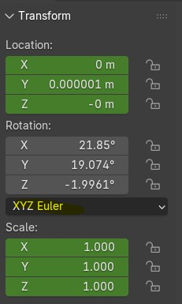

Transfer Keyframes
```````````````````````
*Destructive operation, making a copy is recommended*

Copy animation data from one keyframe group to another.

.. image:: TransferOp.JPG

* **Slot** , The source Slot containing animation data.
* **From** , The source fcurve Group.
* **To** , The Target fcurve Group.
* **Remove From Source** , Delete Source keyframes after copying them to the target channels. Otherwise, frames will be left but channels are muted.
* * **Replace with zero values** , Replace deleted channels with start and end keyframes with zero values. This prevents undesirable inheritance from previous actions of if there aren't previous frames, it resets the values rather than leaving behind using ambiguous values. **NOTE:**, scale channels will use a value of 1.0 instead.
* **Convert To Euler** , Ensure's that the newly copied frames are also Euler if Quaternion rotations are enabled.
* **Location Keys** , Copy Location keyframes from the Source.
* **Rotation Euler Keys** , Copy Euler Rotations from Source.
* **Quaternion WXYZ** , Copy Quaternion keyframes from source.
* **Scale Keys** , Copy XYZ Scale keyframes from source.

Convert Mixamo Action
```````````````````````

*Destructive operation, making a copy is recommended*

A combination of Create Root if none is assigned, Transfer keyframes, Evaluate Root Vectors and Convert to Euler (root bone) with options suitable for Mixamo animations to work with root motion.

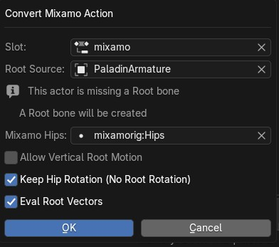

* **Slot** , The Action Slot to convert containing root animation.
* **Root Source** , The root fcurve group. If none is set, a root bone will be created and assigned.
* **Mixamo Hips** , If there is no root bone, chose the hip bone to be the child of the new root.
* **Allow Vertical Root Motion** , Includes vertical Y axis positions for root motion.
* **Keep Hip Rotation** , In some cases the character will perform all actions in a straight line such as walking jumping and running. Therefore the hips y rotations are best if left on the hips.
   This is sometimes also the case for non-traversal animations so long as the character is expected face the original direction. Uncheck this option if the character is turning such as 'walk turn' animations.
* **Eval Root Vectors** , Ensures that root keyframes are complete 3D vectors, for example a location x keyframe is always paired with location y and z keyframes. This makes root motion more deterministic and avoids undesired calculations. For Mixamo this usually isn't required unless frame reduction is was enabled.

Evaluate Root Vectors
```````````````````````

*Destructive operation, making a copy is recommended*

Ensures that root keyframes are complete 3D vectors, for example a location x keyframe is always paired with location y and z keyframes. This makes root motion more deterministic and avoids undesired calculations.

Channel Filters
~~~~~~~~~~~~~~~

*Action Blocks node-graph Right Panel->Node*

Allows non-destructive modifications to specified fcurve groups and transform channels. Create filter groups to selectively use animation channels. For example only enable upper body animation for use with mixing into full body animation.
They can also be use to offset values using addition and multiplication. Additional option are displayed for the root channel.

.. image:: ActionNodeFilter.JPG

* **Slot** , Filter groups are created per slot. Available slots are detected from the assigned action, see Action Node Advanced options for slot related properties. 
* **Add** , Add a new filter group and assign an available fcurve group.
* **Mode** , ie. Exclude + Head Bone will not use Head Bone animation from the node's Action.
* * **Exclude**, Don't use checked filter groups for this block.
* * **Include**, Only use checked filter groups for this block.
* * **Custom**, Unchecked filter groups are excluded, all others are included including those without filters.
  
* **Location/Rotation +** , Add offset to these channels.
* **Location/Rotation** , Multiply(scale) the existing values on these channels.
* **Blend Weight** , Multiply the blend strength for blending operations. Root is always zero. 
* **Remove** , Delete filter group. Does not affect source animation.

Root Offsets
````````````
*Filters->Filter group with root group assigned*

Create root motion paths using a root filter group.

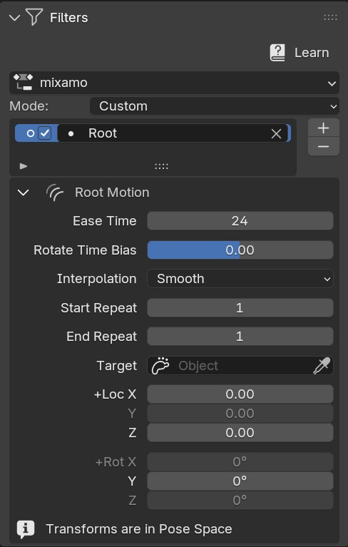

* **Ease Time** , number of frames to blend-in offsets. Capped at the Action duration. Original frames are removed within this range. **NOTE:** Easing does not cross over repeats.
* **Rotate Time Bias**, within the ease time, rotations are by default half the duration. Use this property to make rotations complete sooner (-value) or later (+value), factor is between Repeat start frame and Ease Time.
* **Interpolation** 

**Arc** , Uses auto-aligned bezier handles on affected keyframes and creates location keyframes in-line with the rotation mid-frame, resulting is a more rounded easing.

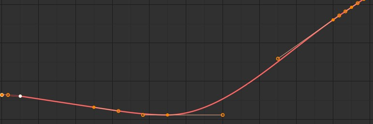
 
**Smooth** , Sets affected handles to auto bezier and calculates handle positions based on the next frame. Unlike the Arc option, it does not create a mid-frame and can results in much more gradual easing. If the offset is to extreme and keyframes are sparse, this mode can result in overly extended handles.

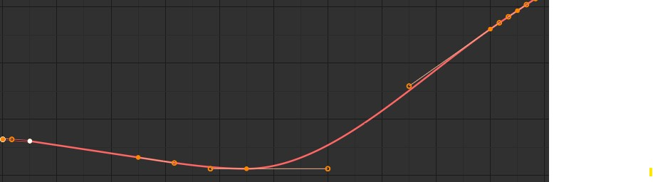

**Linear** , All affected frames are set to linear interpolation without keyframe handles.

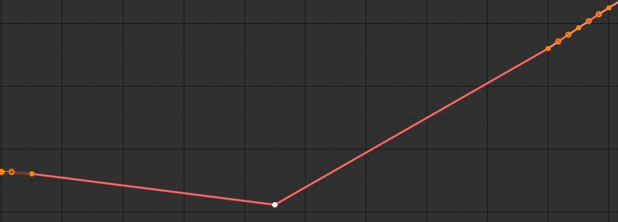

* **Start Repeat** , The action's Repeat count to start the offset on.
* **End Repeat**, The action's Repeat count to end the offset on.
* **Target** , Optionally use a target objects coordinates for the offset location.
* **+ Rotation** , Manual rotation offset in degrees.
* **+ Location** , Manual location offset in meters. **Note:** this may be scaled by the owner scale or parent object. Eg. And armature scaled at 0.01 xyz will make these values 0.01 smaller than world space coordinates.

Mix Node
========

.. image:: MixNode.JPG

Note: To layer animations, its best to leave channels free for input 2. For example, when combining walking (action1) with a head turn(action2), only have keyframes for the neck in action1 and only have neck keyframes in action2.


**Modes** 

* **Combine**  ,Use keyframes from both inputs, input 2 will fill any missing frames from input1. . 

* **Replace** ,Excludes frames from input1 where there are frames in range for input2, only replaces available input2 channels. 

* **Extend**  ,Add input2 to the end time of input1

* **Blend-in/Out** , (Only for Replace), blend frames in and out of input2.

* **Use Range** , The frame range for mix to take affect, action output time.

Spacer Node
============

.. image:: SpacerNode.JPG

The Spacer Node can be used to add extra time, before, between or after blocks. Using a spacer between blocks can function like a blended transition.

* **Duration** , The amount of frames for the space duration.

* **Interpolation**
* * **Linear** , converts the previous keyframe curve for Linear interpolation. 
* * **Bezier** , convert the previous two keyframes to bezier curves. 
* * **Hold** , adds an extra hold frame before the next block.


Frame Step Node
===============
.. image:: FrameStepNode.JPG

* **Frame Step** , reduce frames by keeping only every nth frame.

Value Node
==========
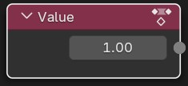

This node can be used as input for durations sockets, repeats, start and end ranges for mix nodes. Float (decimal) values will be rounded to integers where necessary.


