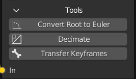

=============
Action Blocks 
=============

https://twitter.com/OTrealms

:Version: 0.1.0

Action Blocks is a Blender addon addon for constructing complex animations using real keyframes and Actions within a custom node-graph interface. 

Install using .zip file in Preferences->Addons->Install. There is no need to extract the .zip file.

.. contents::

Recommended Practices and tips
------------------------------

* **Pose Markers are cleared and generated in the Action Editor/Dope Sheet for the output Action.**

* **Start animations on frame 1** Starting an animation at frame zero can create duration calculation issues for node display and generation of pose markers.

* **Optimize animations** Actions Nodes can become slow if Actions contain keyframes on every frame, for every channel. This be the case when the animation is baked or derived from performance capture. Use the decimator in the Animation Curves window or Decimate operator on the Action Node -> Tools, to reduce unnecessary frames. 

* **Make a dedicated Root Bone** when using Root Motion if a root and includes a lot of movement. This may be the case with Hip/Root bones. Use the Transfer Keyframes Action Operator to copy selective channels to the new root. The new root channel group must first be intiliased on the action by keying the disired channels. Often only the forward axis and vertical axis of rotation needs to be transferred. 

* **Make sure rotations are using Euler rotations** when using Root Motion. Use the Convert Root To Euler operator if rotations are quaternion. This will create new roation channels and mute the old ones. Remember to also set the correct rotation mode on the Actor's root transform settings.

Nodes
-----

Freeze
======
Freeze this node and all previous nodes, saving their frame range from being calculated and overwritten.
Un-freezing a node at the beggining of a chain will recursively unfreeze all nodes along the chain.

Action Out Node
===============

.. image:: ActionOutNode.JPG

* **Target Action** , The Action to write keyframes onto.

* **Auto-Refresh** , Update the Target Action when adjusting parameters or socket links.

* **Root Motion** , Use the accumulated position and rotation of the root group for calculating motion such as walking.

* **Quality**
* * **Full** , No reduction in data.
* * **Draft** , Speed up build time by only using frame times and values, excludes handles.

* **Frame Step** , Reduce frames by keeping only every 'nth' frame for faster build time, especially when using baked or motion capture data. Does not affect root group.

* **Hold Frames** , Hold frames will be added at the end of each action or repeat such as when using Action Range. Not compatible with root motion.

* **Root**, The Root group used for motion and rotation.

Action Node
============

.. image:: ActionNode.JPG

**Action In** , An input Action to contribute to the constructed output.

**Frame Colour** , Set the dopesheet frame colour for this action's portion of the output.

**Blend In** , Then number of frames to blend between current Action and previous frames.

**Action Range** , The Action's frame range, this uses built-in Action settings and is not controlled per-node.

**Block Range** , The node's output frame range. 'Start' is relative block's first frame, 'End' is global time.

**Root Motion**, Apply root motion to and from this Action.

Mix Node
========

.. image:: MixNode.JPG

**Modes** 

* **Combine**  ,Use keyframes from both inputs, input 2 will replace any overlapping frames. 

* **Replace** ,Excludes frames from input1 where there are frames in range for input2, only replaces available channels. 

* **Extend**  ,Add input2 to the end of input1

**Use Range** , The frame range for mix to take affect.

Spacer Node
============

.. image:: SpacerNode.JPG

The Spacer Node can be used to add extra time, before, between or after blocks. Using a spacer between blocks can function like a blended transition.

* **Duration** , The amount of frames for the space duration.

* **Interpolation**

* * **Linear** and **Bezier** , convert the last keyframe curve. 

* * **Hold** , adds an extra hold frame before the next block.

Actors
------

.. image:: Actors.JPG

Actors provide a convenient way to select objects and edit action on the correct object. An actor can be any object with animation data and an assigned action.
If the assigned action is of the regular animation type, a root group can be set. When there are multiple actors, each Action Blocks node group will remember the last active actor.
Actors are used to pre-fill operators such as Edit, Decimate, Convert Root to Euler and Transfer Keyframes

Action Operators
----------------

Transfer Keyframes
==================

(destructive), Clear root keyframes and copy animation data from one channel group to another. Useful when creating a new root bone with selective channels. Choose between location, rotation and scale keys. The source channels will be muted.

Decimate
========

Reduce keyframe on this action (destructive) using the ratio method. 

**Ratio** , The portion of keyframes to remove.

Convert Root To Euler
======================

Convert root rotations from quaternions to euler rotation keys. Creates new channels and disables the quaternion channels. Make sure that the rotation mode is also changed on the root of the Actor.

