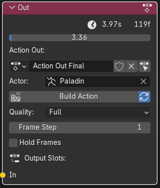
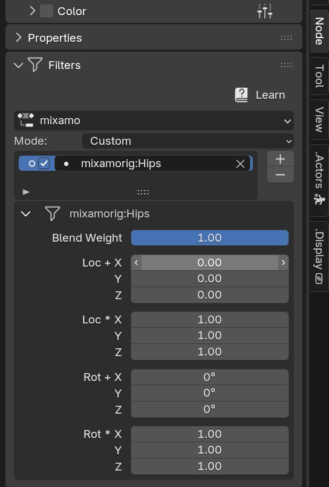
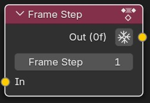

=============
Action Blocks 
=============

https://twitter.com/OTrealms

:Version: 0.1.2

Action Blocks is a Blender add-on for constructing complex animations using real keyframes and Actions within a custom node-graph interface. 

Install using .zip file in Preferences->Addons->Install. There is no need to extract the .zip file.

.. contents::

Recommended Practices and tips
------------------------------

* **Pose Markers** are cleared and generated in the Action Editor/Dope Sheet for the output Action.

* **Start animations on frame 1** Starting an animation at frame zero can create duration calculation issues for node display and generation of pose markers.

* **Optimize animations** Actions Nodes can become slow if Actions contain keyframes on every frame, for every channel. This be the case when the animation is baked or derived from performance capture. Use the decimator in the Animation Curves window or Decimate operator on the Action Node -> Tools, to reduce unnecessary frames. 

* **Make a dedicated Root Bone** When using Root Motion if a root and includes a lot of movement. This may be the case with Hip/Root bones. Use the Transfer Keyframes Action Operator to copy selective channels to the new root. The new root channel group must first be intiliased on the action by keying the disired channels. Often only the forward axis and vertical axis of rotation needs to be transferred. 

* **Make sure rotations are using Euler rotations** When using Root Motion. Use the Convert Root To Euler operator if rotations are quaternion. This will create new roation channels and mute the old ones. Remember to also set the correct rotation mode on the Actor's root transform settings.

* **Include Scale Keyframes.** If there are no scale frames it can result in 0,0,0 scale values and actors that appear to shrink or grow. If this happens Alt-S will reset the the scale values to 1,1,1, Then ensure actions contain scale frames. Keep in mind that trimming such as using Action Range may exclude these frames.

Nodes
-----

Freeze
======
Freeze this node and all previous nodes, saving their frame range from being calculated and overwritten.
Un-freezing a node at the beggining of a chain will recursively unfreeze all nodes along the chain.

Action Out Node
===============

* **Target Action** , The Action to write keyframes onto.

* **Buil Action** , manually rebuild animation output, required if  not using Auto-Refresh and when only updating source Actions without adjusting node parameters/

* **Auto-Refresh** , Update the Target Action when adjusting parameters or socket links.

* **Quality**

* * **Full** , No reduction in data.

* * **Draft** , Speed up build time by only using frame times and values, excludes handles.

* **Frame Step** , Reduce frames by keeping only every 'nth' frame for faster build time, especially when using baked or motion capture data. Does not affect root group.

* **Hold Frames** , Hold frames will be added at the end of each action or repeat such as when using Action Range. Not compatible with root motion.

* **Root Motion** , Use the accumulated position and rotation of the root group for calculating motion such as walking.

* * **Root**, The Root group used for motion and rotation.

* * **Allow Blending**, Allow blending operation availbale on each node to affect the Root channels.

* * **Slide Removal**,Uses Pose Bones to contrain Root motion movement to activity of Pose Bones such as thighs(Fk) or feet controllers(IK).

* * **Method**, Pose Bone animation affects root translation using the method; MIN-The lowest value is used, MAX-Highest value is used to constrain, SUM-The total of values are used to constrain Root translation.

* * **Location/Rotation**, The axis which will be used for root motion. Note, objects will typically use Z up in world space with the exception of cameras which have Y up. Bones transforms are relative to parents and therefore have their own rotation matrices and can differ depending on rigging convention and source of armature. For example a root bone sourced from another software may be forward facing rather than vertical when imported.  

Action Node
============

.. image:: ActionNode.JPG

* **Action In** , An input Action to contribute to the constructed output.

* **Frame Colour** , Set the dopesheet frame colour for this action's portion of the output.

* **Scale** , Temporal scale the the action.

* **Repeat** , Repeat the entire action.

* **Blend In** , Then number of frames to blend between current Action and previous frames.

* **Reverse** , Reverse the action, Roo Motion not supported.

* **Action Range** , The Action's frame range, this uses built-in Action settings and is not controlled per-node.

* **Block Range** , The node's output frame range. Relative to block's first frame.

* **Match Pose/Seek** , Match the previous Block's end frame with the most similar frame in this blocks animation, within seek distance (preformance warning: evaluates interpolated frames within seek distance).

* **Root Motion**, Apply root motion to and from this Action.

* * **Rot/loc** , Flip the roation and location frames of the root bone. Works best used if all bones and controls are within the Root bones heirarchy.

Action Looping
==============

.. image:: ActionNodeLoop.JPG

* **Loop Blend** , Blend action between repeats, to improve looping.

* * **Direction** , Only affect frames in a certain direction to match the start and end of the action.

Action Operators
==================

* **Convert To Euler** , Convert the Action's bone rotations from quaternions to euler rotation keys. Creates new channels and disables the quaternion channels. Make sure that the rotation mode is also changed on the bone of the Actor.

* **Decimate** , (destructive), Clear root keyframes and copy animation data from one channel group to another. Useful when creating a new root bone with selective channels. Choose between location, rotation and scale keys. The source channels will be muted.

* * **Ratio** , The portion of keyframes to remove.

.. image:: TransferOp.JPG

* **Transfer Keyframes** ,Copy animation data from one keyframe group to another.

* * **From** , The source Keyframe Group.
* * **To** , The Target Keyframe Group.
* * **Remove From Original** , Delete Source keyframes aftercopying. Tip: it may be a good idea to add a new first frame to the deleted group to avoid unwanted drifting.
* * **Convert To Euler** , Ensure's that the newly copied frames are also Euler if Quaternion roations are enabled.
* * **Location Keys** , Copy Location keyframes from the Source.
* * **Rotation Euler Keys** , Copy Euler Rotations from Source.
* * **Quaternion WXYZ** , Copy Quaternion keyframes from source.
* * **Scale Keys** , Copy XYZ Scale keyframes from source.

* **Filter Groups** ,create filter groups to selectively use animation channels. For example only enable upper body animation for use with mixing into full body animation.

* * **Add** , Add a new filter group
* * **Mode** , Exclude or include filtered groups, ie. Exclude + Head Bone will not use Head Bone animation fronm the node's Action.
* * **Activate Filter**, Disable filter, can be used with Exlude mode if only using it to control Blend weight.
* * **Loc** , Bone Location offset.
* * **Blend Weight** , Override the bone's influence when using blending operations.
* * **Remove** , Delete filter group

Mix Node
========

.. image:: MixNode.JPG

Note: To layer animations, its best to leave channels free for input 2. For example, when combining walking (action1) with a head turn(action2), only have keyframes for the neck in action1 and only have neck keyframes in action2.

**Modes** 

* **Combine**  ,Use keyframes from both inputs, input 2 will fill any missing frames from input1. . 

* **Replace** ,Excludes frames from input1 where there are frames in range for input2, only replaces available input2 channels. 

* **Extend**  ,Add input2 to the end time of input1

* **Blend-in/Out** , (Only for Replace), blend frames in and out of input2.

* **Use Range** , The frame range for mix to take affect, action output time.

Spacer Node
============

.. image:: SpacerNode.JPG

The Spacer Node can be used to add extra time, before, between or after blocks. Using a spacer between blocks can function like a blended transition.

* **Duration** , The amount of frames for the space duration.

* **Interpolation**
* * **Linear** , converts the previous keyframe curve for Linear interpolation. 
* * **Bezier** , convert the previous two keyframes to bezier curves. 
* * **Hold** , adds an extra hold frame before the next block.

Frame Step Node
===============

* **Frame Step** , reduce frames by keeping only every nth frame.

Actors
------

.. image:: Actors.JPG

Actors provide a convenient way to select objects and edit action on the correct object. An actor can be any object with animation data and an assigned action.
If the assigned action is of the regular animation type, a root group can be set. When there are multiple actors, each Action Blocks node group will remember the last active actor.
Actors are used to pre-fill operators such as Edit, Decimate, Convert Root to Euler and Transfer Keyframes

**Pose Bones** , Pose bones are important bones for a gait cycle for functions including Pose Matching and Slide Removal. For FK rigs, upper thigh and arm rotation is recommend. IK limbs are best associated with control bone locations.

